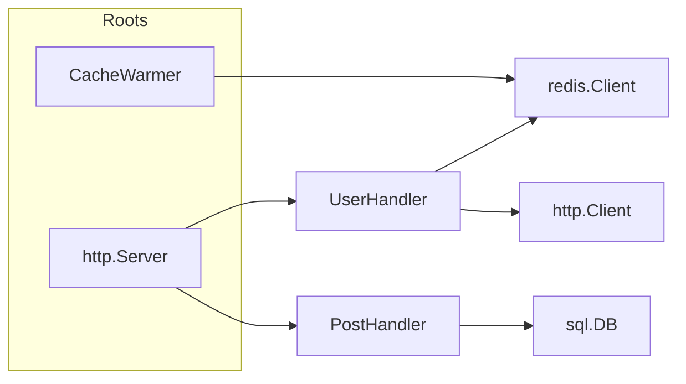

# Container

Container is the abstraction responsible for holding all constructors and values.
It’s the primary means by which an application interacts with Fx.
You teach the container about the needs of your application,
how to perform certain operations,
and then you let it handle actually running your application.

Fx does not provide direct access to the container.
Instead, you specify operations to perform on the container
by providing `fx.Option`s to the `fx.New` constructor.

```go
package fx

type App
  func New(opts ...Option) *App
  func (app *App) Run()

type Option
  func Provide(constructors ...interface{}) Option
  func Invoke(funcs ...interface{}) Option
```

Check the [API Reference](https://pkg.go.dev/go.uber.org/fx#Option)
for a complete list of options and their behaviors.

## Providing values

You must provide values to the container before you can use them.
Fx provides two ways to provide values to the container:

- `fx.Provide` for values that have a constructor.

  ```go
  fx.Provide(
    func(cfg *Config) *Logger { /* ... */ },
  )
  ```

  This says that Fx should use this function to construct a `*Logger`,
  and that a `*Config` is required to build one.

- `fx.Supply` for pre-built non-interface values.

  ```go
  fx.Provide(
    fx.Supply(&Config{
      Name: "my-app",
    }),
  )
  ```

  This says that Fx should use the provided `*Config` as-is.

  **Important**: `fx.Supply` is only for non-interface values.
  See [When to use fx.Supply](#when-to-use-fx-supply) for more details.

Values provided to the container are available to all other constructors.
In the example above, the `*Config` would become available to the `*Logger` constructor,
and the `*Logger` to any other constructors that need it.

### When to use fx.Supply

Usually, `fx.Provide` is the right choice because more often than not,
constructing an object requires its dependencies.
`fx.Supply` is a convenience function for the rare cases where that isn't true:
standalone values that don't depend on anything else.

```go
fx.Provide(func() *Config { return &Config{Name: "my-app"} })
// is the same as
fx.Supply(&Config{Name: "my-app"})
```

However, even then, `fx.Supply` comes with a caveat:
it can only be used for non-interface values.

<details>
  <summary>Why can't I use fx.Supply for interface values?</summary>

This is a technical limitation imposed by the fact that `fx.Supply` has to rely
on runtime reflection to determine the type of the value.

Passing an interface value to `fx.Supply` is a lossy operation:
it loses the original interface type, only giving us `interface{}`,
at which point reflection will only reveal the concrete type of the value.

For example, consider:

```go
var svc RepositoryService = &repoService{ ... }
```

If you were to pass `svc` to `fx.Supply`,
the container would only know that it's a `*repoService`,
and it will not know that you intend to use it as a `RepositoryService`.

</details>

## Using values

Providing values to the container only makes them available to the application.
It doesn't do anything with them yet.
Constructors passed to `fx.Provide` are not called until they are needed.

For example, the following won't do anything:

```go
fx.New(
  fx.Provide(newHTTPServer), // provides an *http.Server
).Run()
```

You next have to tell the container what is needed, and what to do with it.
Fx provides [`fx.Invoke`](https://pkg.go.dev/go.uber.org/fx#Invoke) for this purpose.

In the example above, we'll want an invocation that starts the server:

```go
fx.New(
  fx.Provide(newHTTPServer),
  fx.Invoke(startHTTPServer),
).Run()
```

### When to use fx.Invoke

`fx.Invoke` is typically used for root-level invocations,
like starting a server or running a main loop.
It's also useful for invoking functions that have side effects.

Examples of cases where you might use `fx.Invoke`:

- Starting a background worker
- Configuring a global logger

As an example, consider an application organized into many distinct abstractions.



`CacheWarmer` and `http.Server` are the roots of the application.
We'll need `fx.Invoke` for the side effects of starting the server
and the cache warmer loop.
Everything else will be handled by the container automatically.
