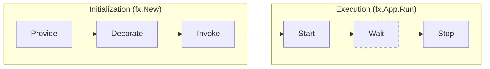

# Application lifecycle

The lifecycle of an Fx application has two high-level phases:
*initialization* and *execution*.
Both of these, in turn are comprised of multiple steps.

During **initialization**, Fx will,

- register all constructors passed to `fx.Provide`
- register all decorators passed to `fx.Decorate`
- run all functions passed to `fx.Invoke`,
  calling constructors and decorators as needed

During **execution**, Fx will,

- run all startup hooks appended to the application
  by providers, decorators, and invoked functions
- wait for a signal to stop running
- run all shutdown hooks appended to the application

## Lifecycle hooks

Lifecycle hooks provide the ability to schedule work to be executed by Fx,
when the application starts up or shuts down.
Fx provides two kinds of hooks:

- *Startup hooks*, also referred to as `OnStart` hooks.
  These run in the order they were appended.
- *Shutdown hooks*, also referred to as `OnStop` hooks.
  These run in the **reverse** of the order they were appended.

Typically, components that provide a startup hook
also provide a corresponding shutdown hook to
release the resources they acquired at startup.

Fx runs both kinds of hooks with a hard timeout enforcement.
Therefore, hooks are expected to block only as long as they need
to *schedule* work.
In other words,

- hooks **must not** block to run long-running tasks synchronously
- hooks **should** schedule long-running tasks in background goroutines
- shutdown hooks **should** stop the background work started by startup hooks
