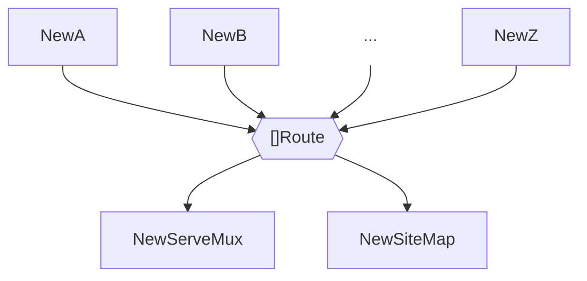
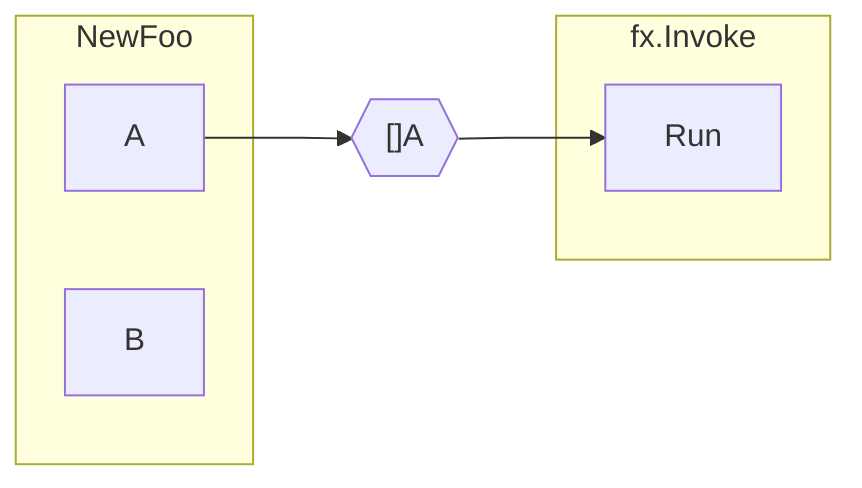
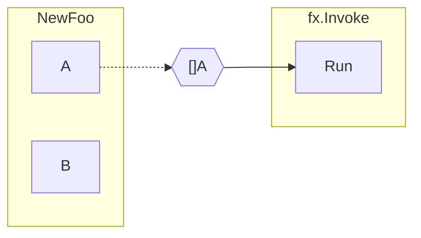
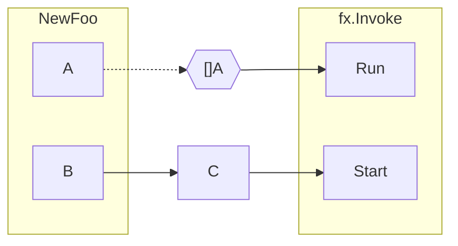

# Value Groups

A *value group* is a collection of values of the same type.
Any number of constructors across an Fx application
can feed values into a value group.
Similarly, any number of consumers can read from a value group
without knowing about the full list of producers.

::: tip
Fx produces the values fed into a value group in a random order.
**Do not** make any assumptions about value group ordering.
:::

## Using value groups

To learn how to use value groups, see,

- [Feeding value groups](feed.md)
- [Consuming value groups](consume.md)

## Dependency strictness

Dependencies formed by value groups can be:

- strict: these are always consumed
- soft: these are consumed only if the corresponding constructor
  was requested elsewhere

By default, value group dependencies are strict.

### Strict value groups

Strict value group dependencies are consumed by the value group
regardless of whether their producers are otherwise used by the application.

Suppose a constructor `NewFoo` produces two values: `A` and `B`.
Value `A` feeds into the value group `[]A`,
which is then consumed by function `Run`,
and the application invokes function `Run` with `fx.Invoke`.

With strict value groups,
Fx will run `NewFoo` to populate the `[]A` group
regardless of whether the application consumes the other result (`B`)
directly or indirectly.

### Soft value groups

Soft value group dependencies are consumed by the value group
only if the constructors that produce them were called by Fx anyway --
because the application consumes their other results directly or indirectly.

Suppose we have a setup similar to the previous section,
except that the value group is soft.

With soft value groups,
Fx will run `NewFoo` to populate the `[]A` group
only if `A` or `B` are consumed by another component in the application
directly or indirectly.

<!--
// TODO: when to use strict vs soft value groups
-->
